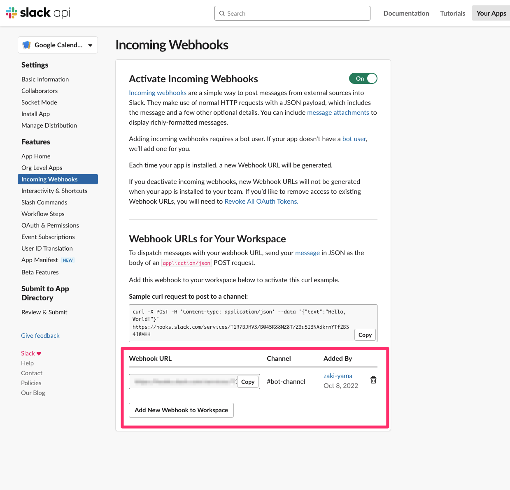
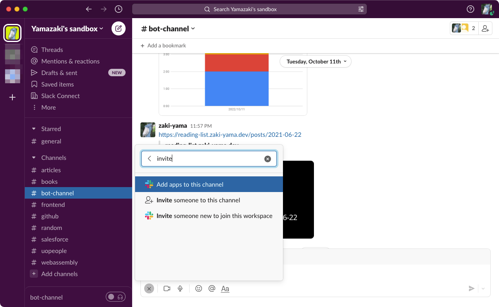
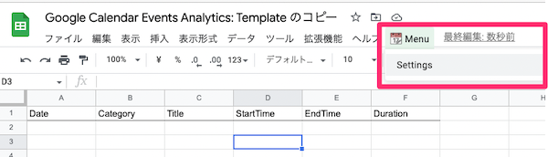
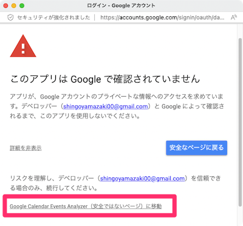
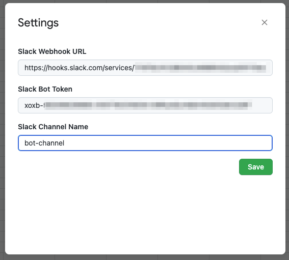
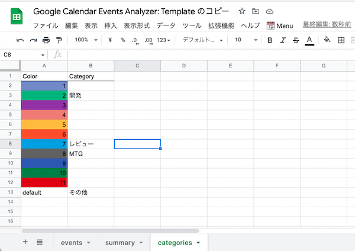
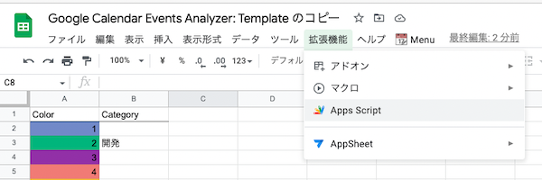
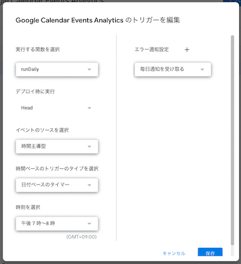
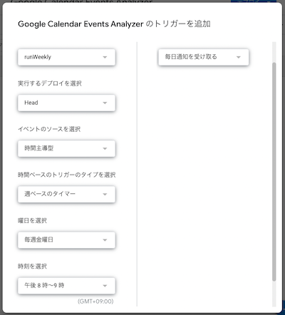

# Google Calendar Events Analytics

Google カレンダーの予定を色別に集計し、Slack に投稿する Bot です。

## インストール方法

### 1. Slack アプリを作成する

- https://api.slack.com/apps で新規 App を作成する
- Incoming Webhooks から、 Slack 投稿先のチャンネルを登録し Webhook URL [1] を発行する

- OAuth & Permissions > Scopes に `files:write` を追加する

- Bot User OAuth Token [2] をコピー

### 2. Slack ワークスペースに Slack アプリをインストールする

- すでにインストール済みになっていたら再インストールする
- 投稿先のチャンネルに Slack アプリを追加する

  

### 3. スプレッドシートの作成

- https://docs.google.com/spreadsheets/d/1uf5XqUqcsIfwMdeJYZg6rJ3psmPPnJhMKf9OouLl55c/edit からスプレッドシートをコピーする
- スプレッドシートの `📆 Menu > Settings` を開く

  

- 認証が求められるので、許可する

  - 「このアプリは Google で確認されていません」と表示されるが、 `詳細 -> Google Calendar Events Analytics（安全ではないページ）に移動` を選択

  
  

- 再度 `📆 Menu > Settings` を開き、Slack アプリを作成したときの [1] Webhook URL、 [2] Bot User OAuth Token、 [3] 投稿先の Slack チャンネル名を入力する

  

- `categories` シートに、集計したい色ごとにカテゴリ名を設定する

  

- 以下 2 つの時間ベースのトリガーを設定する

| 関数名      | やっていること                                     | トリガーの頻度 |
| :---------- | :------------------------------------------------- | :------------- |
| `runDaily`  | その日の Google カレンダー予定を集計、Slack に投稿 | 毎日           |
| `runWeekly` | その週のサマリをグラフで Slack に投稿              | 毎週           |

