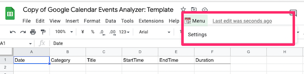
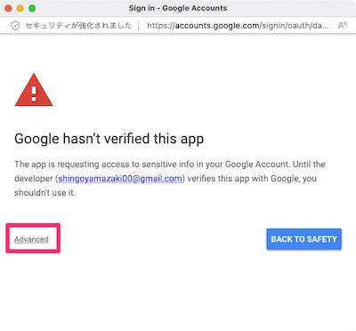
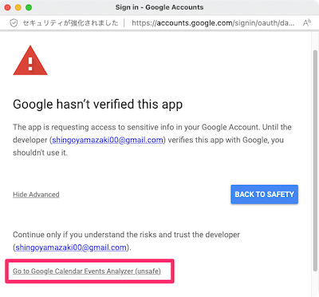
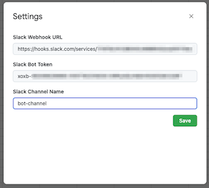
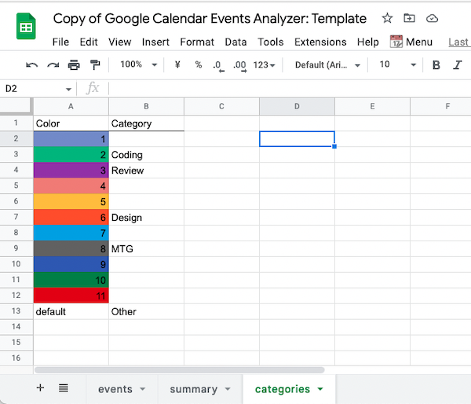
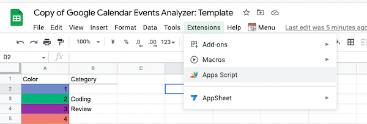
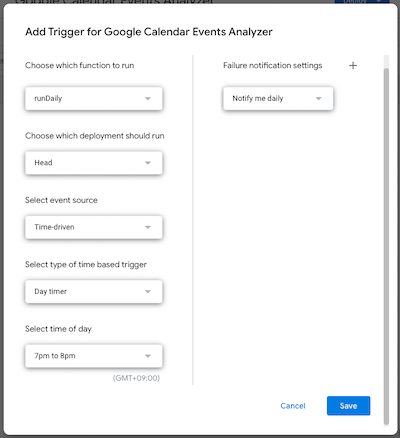
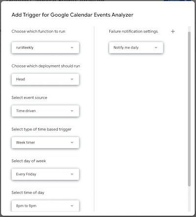

# Google Calendar Events Analyzer

Slack Bot that aggregates Google Calendar's events by colors, and send the summary chart to Slack.

## Installation

### 1. Create Slack App

- Open https://api.slack.com/apps and create new Slack App
- In `Incoming Webhooks`, input the channel name you want to post the message. Then obtain Webhook URL [1]

- In `OAuth & Permissions > Scopes`, add `files:write`

- Copy `Bot User OAuth Token` [2]

### 2. Install the Slack App in your Slack Workspace

- If it's already installed, re-install it (needed because you changed the app's scope)
- Add the Slack App to the channel

  

### 3. Create Spreadsheet

- Copy https://docs.google.com/spreadsheets/d/1uf5XqUqcsIfwMdeJYZg6rJ3psmPPnJhMKf9OouLl55c/edit
- Open `📆 Menu > Settings` in the Spreadsheet

  

- Authorize it

  - You might see "Google hasn't verified this app" in the popup, click `Advanced -> Go to Google Calendar Events Analyzer (unsafe)`

  
  

- Open `📆 Menu > Settings` again, input [1] Webhook URL, [2] Bot User OAuth Token, [3] Slack channel name

  

- In `categories` sheet, input category names next to the color cells you want to aggregate

  

- In `Apps Script` menu, add the following 2 triggers

| Function    | What it does                                               | type of time based trigger |
| :---------- | :--------------------------------------------------------- | :------------------------- |
| `runDaily`  | Aggregate today's Google Calendar events and post to Slack | Day timer                  |
| `runWeekly` | Post the weekly summary chart to Slack                     | Week timer                 |

